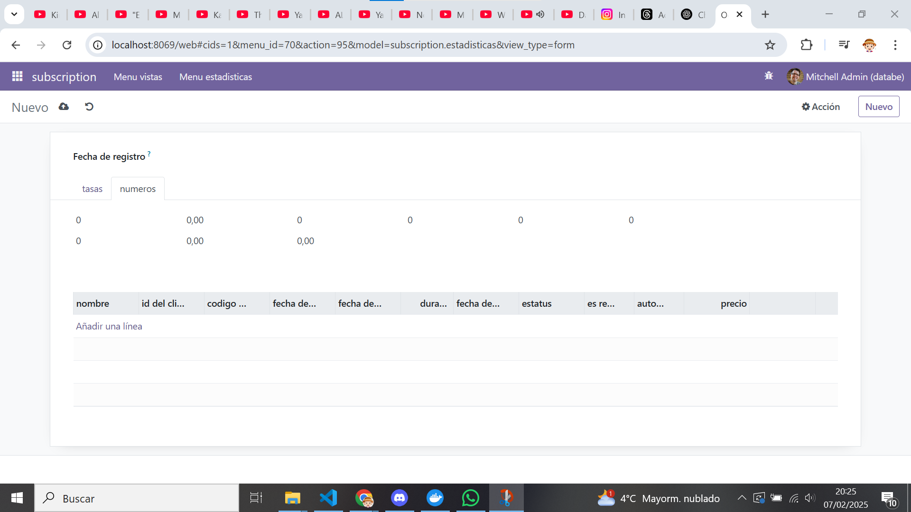

[Proyectos](../index.md)

# Proyecto de la 2ª Evaluación: Extensión del modelo de suscripciones mediante métricas y estadísticas

---     
[Proyecto 2º evaluacion](https://vgonzalez165.github.io/apuntes_sge/proyectos/proyecto_ev2.html)

## ¿Que vamos a hacer?
Como tenemos muy poco tiempo para desarrollar este proyecto, vamos a reutilizar las prácticas que hemos hecho con un módulo para la gestión de suscripciones. El objetivo será extender ese módulo con otro modelo de Métricas y estadísticas.

[Modulo subscripciones](Juan_Blas_Martinez_subscription.rar)

# 1. Editamos el modelo del módulo
Tenemos que añadir 1 modelo para que esto funcione, uno de **subs**.

### Modelo subs

Primero crearemos el modelos de estadísticas dentro de la carpeta models, lo llamaremos **estadisticas.py** y le añadiremos los campos necesarios con las calculaciones necesarias para que funcione correctamente:

``` python
# -*- coding: utf-8 -*-

from odoo import models, fields, api


class estadisticas(models.Model):
    _name = 'subscription.estadisticas'
    _description = 'subscription.subscription'
    _sql_constraints = [
        ('unique_name', 'unique(name)', "El nombre debe ser único"),
    ]

    fecha_registro = fields.Date(string="fecha")
    numero_subscripcion = fields.Integer(string="Numero de subscripciones activas")
    ingresos_generados = fields.Float()
    tasa_renovacion = fields.Float(compute="_renovation_rate_calculation")
    tasa_cancelacion = fields.Float(compute="_cancelation_rate_calculation")
    numero_renovaciones = fields.Integer()
    nuevas_suscripciones = fields.Integer()
    suscripciones_canceladas = fields.Integer()
    clientes_nuevos = fields.Integer(string="nuevos clientes")
    clientes_recurrentes = fields.Integer(string="Clientes recurrentes")
    ingresos_promedios_por_usuarios = fields.Float(compute="_ipu_calculation")
    tasa_conversion = fields.Float()
    tasa_perdida_clientes = fields.Float(compute="_cancelation_rate2_calculation")
    valor_vida_cliente = fields.Float()
    costo_adquisicion_cliente = fields.Float()
    notas = fields.Text()
    relacion_suscripciones = fields.One2many(comodel_name='subscription.subs', inverse_name='subscription_code')


    @api.depends('numero_renovaciones', 'numero_subscripcion')
    def _renovation_rate_calculation(self):
        for subs in self:
            if subs.numero_renovaciones != 0 and subs.numero_subscripcion != 0:
                subs.tasa_renovacion = (subs.numero_renovaciones / subs.numero_subscripcion) * 100
            else:
                subs.tasa_renovacion = 0

    @api.depends('suscripciones_canceladas', 'numero_subscripcion')
    def _cancelation_rate_calculation(self):
        for subs in self:
            if subs.suscripciones_canceladas != 0 and subs.numero_subscripcion != 0:
                subs.tasa_cancelacion = (subs.suscripciones_canceladas / subs.numero_subscripcion) * 100
            else:
                subs.tasa_cancelacion = 0

    @api.depends('suscripciones_canceladas', 'numero_subscripcion')
    def _cancelation_rate2_calculation(self):
        for subs in self:
            if subs.suscripciones_canceladas != 0 and subs.numero_subscripcion != 0:
                subs.tasa_perdida_clientes = (subs.suscripciones_canceladas / subs.numero_subscripcion) * 100
            else:
                subs.tasa_perdida_clientes = 0

    @api.depends('valor_vida_cliente', 'numero_subscripcion')
    def _ipu_calculation(self):
        for subs in self:
            if subs.valor_vida_cliente != 0 and subs.numero_subscripcion != 0:
                subs.ingresos_promedios_por_usuarios = (subs.valor_vida_cliente / subs.numero_subscripcion) * 100
            else:
                subs.ingresos_promedios_por_usuarios = 0
```

# 2. Editamos el archivo __init__.py

Le añadimos las importaciones de los nuevos modelos al archivo de **__init__.pyt** para que odoo pueda  acceder a los modelos que hemos creado hace un momento.  

``` python
# -*- coding: utf-8 -*-

from . import subs, estadisticas
```

# 3. Editamos el archivo de seguridad
Editamos el archivo ir.model.access.csv para que registre los nuevos modelos que hemos creado en la base de datos de odoo.

```
id,name,model_id:id,group_id:id,perm_read,perm_write,perm_create,perm_unlink
access_subscription_subscription,subscription.subs,model_subscription_subs,base.group_user,1,1,1,1
access_subscription_estadisticas,subscription.estadisticas,model_subscription_estadisticas,base.group_user,1,1,1,1
```

# 4. Creamos nuevos archivos en la carpeta de views
Crearemos 1 archivo xml de vista que muestre lo que hemos cambiado en el modelo y modificamos el archivo del menú para poder mostrar los cambios.

### Vista de estadisticas:
``` xml
<odoo>
  <data>
    <!-- explicit list view definition -->

    <record model="ir.ui.view" id="view_estadisticas_form_basic">
      <field name="name">subscription form</field>
      <field name="model">subscription.estadisticas</field>
      <field name="arch" type="xml">
        <form string="Presas">
            <sheet>
                <group>
                    <field name="fecha_registro" string='Fecha de registro'/>
                </group>
                <notebook>
                    <page name="tasas" string="tasas">
                        <group>
                            <field name="tasa_renovacion" string='tasa de renovación'/>
                            <field name="tasa_cancelacion" string='tasa de cancelación'/>
                            <field name="ingresos_promedios_por_usuarios" string='Ingresos promedios por usuario'/>
                            <field name="tasa_conversion" string='tasa de conversión'/>
                            <field name="tasa_perdida_clientes" string='tasa de perdidas de clientes'/>
                        </group>
                    </page>
                    <page name="numeros" string="numeros">
                        <field name="numero_subscripcion" string='Numero de subscripciónes'/>
                        <field name="ingresos_generados" string='Ingresos generados'/>
                        <field name="nuevas_suscripciones" string='Numero de nuevas subscripciones'/>
                        <field name="suscripciones_canceladas" string='Numero de subscripciones canceladas'/>
                        <field name="clientes_nuevos" string='Numero de clientes nuevos'/>
                        <field name="clientes_recurrentes" string='Numero de clientes recurrentes'/>
                        <field name="nuevas_suscripciones" string='Numero de nuevas subscripciones'/>
                        <field name="valor_vida_cliente" string='Valor de la vida del cliente'/>
                        <field name="costo_adquisicion_cliente" string='Costo de adquisición de clientes'/>
                        <field name="notas" string='Notas'/>
                        <field name="relacion_suscripciones" string='subscripciones'/>
                    </page>
                </notebook>
            </sheet>
        </form>
      </field>
    </record>

    <!-- actions opening views on models -->

    <record id="action_estadisticas_form" model="ir.actions.act_window">
        <field name="name">estadisticas (Form)</field>
        <field name="res_model">subscription.estadisticas</field>
        <field name="view_mode">tree,form</field>
        <field name="view_id" ref="view_estadisticas_form_basic"/>
    </record>
  </data>
</odoo>
```

### Vista de menu:

``` xml
<odoo>
  <data>
    <!-- Top menu item -->

    <menuitem name="subscription" id="subscription.menu_root"/>

    <!-- menu categories -->

    <menuitem name="Menu vistas" id="subscription.menu_1" parent="subscription.menu_root"/>
    <menuitem name="Menu estadisticas" id="subscription.menu_2" parent="subscription.menu_root"/>

    <!-- actions -->

    <menuitem name="Basics" id="subscription.menu_1_list" parent="subscription.menu_1"
              action="action_subscription_basic"/>
    <menuitem name="Usage" id="subscription.menu_2_list" parent="subscription.menu_1"
              action="action_subscription_usage"/>
    <menuitem name="Form" id="subscription.menu_3_list" parent="subscription.menu_1"
              action="action_subscription_form"/>
    <menuitem name="Estadisticas" id="subscription.menu_4_list" parent="subscription.menu_2"
              action="action_estadisticas_form"/>
  </data>
</odoo>
```

Le hemos dado a las vistas los respectivos cambios para que se pueda mover el usuario con el menú.
También hemos añadido el form para que pueda funcionar

# 5. Modificamos el archivo manifest:
Añadimos el nuevo estadísticas.xml para poder cargarlo más tarde.
``` python
# -*- coding: utf-8 -*-
{
    'name': "subscription",

    'summary': """
        Short (1 phrase/line) summary of the module's purpose, used as
        subtitle on modules listing or apps.openerp.com""",

    'description': """
        Long description of module's purpose
    """,

    'author': "My Company",
    'website': "https://www.yourcompany.com",
    'application': True,

    # Categories can be used to filter modules in modules listing
    # Check https://github.com/odoo/odoo/blob/16.0/odoo/addons/base/data/ir_module_category_data.xml
    # for the full list
    'category': 'Uncategorized',
    'version': '0.1',

    # any module necessary for this one to work correctly
    'depends': ['base'],

    # always loaded
    'data': [
        'security/ir.model.access.csv',
        'views/views_basic.xml',
        'views/views_usage.xml',
        'views/views_form.xml',
        'views/views_estadisticas.xml',
        'views/menus.xml',

    ],
    # only loaded in demonstration mode
    'demo': [
        'demo/demo.xml',
    ],
}
```

# 6. Comprobamos que ha funcionado:
La vista funciona (casi) perfectamente y nos muestra todos los campos que hemos creado y solicitado que se muestren en la vista.
  
 