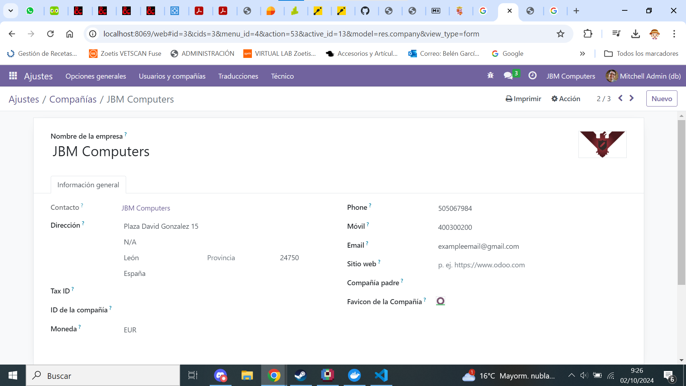
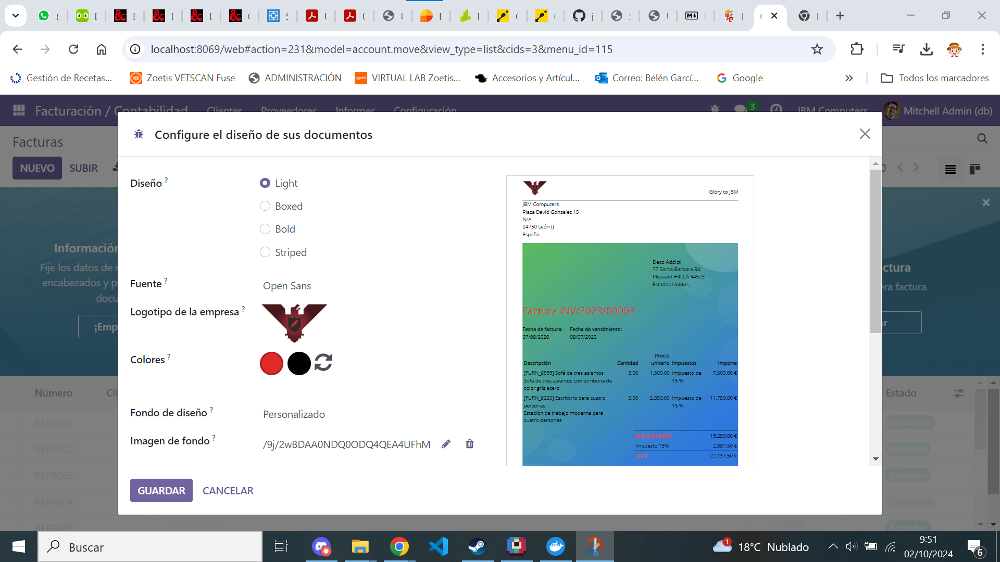
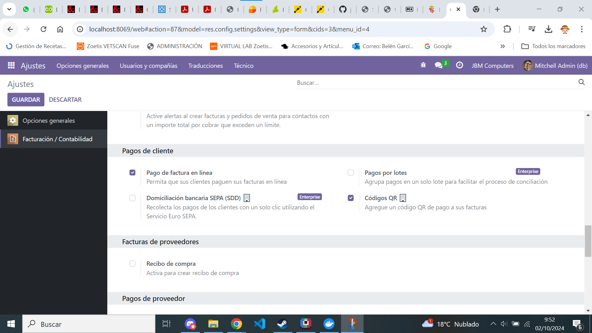
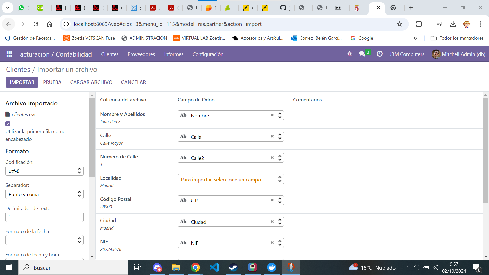
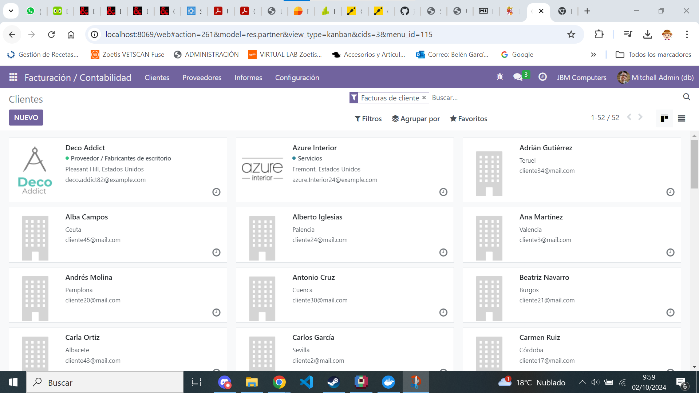
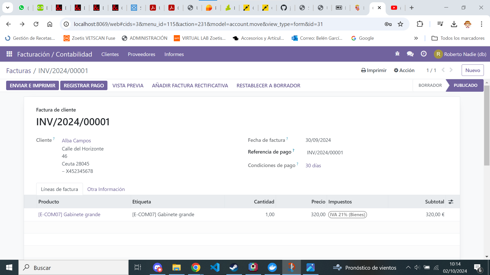

[Tema03](../index.md)

# PR0301: Facturas con Odoo

--- 
[PR0200](https://vgonzalez165.github.io/apuntes_sge/ut02_instalacion/practicas/pr0200.html)
En esta practica apendemos a crear una empresa, un cliente y una factura.

# Pasos realizados:

## Paso1:
Introducimos los datos de la empresa, entrando desde ajustes a compañias: Empresa de nombre JBM Computers, una empresa de material informatico.

## Paso2:
Entramos en ajustes y luego en usuarios, desde ahí creamos un nuevo usuario, en este caso Roberto Nadie, que solo tendrá permisos de ver y utilizar pero no administrar el modulo de facturación.

## Paso3:
Entramos en el módulo de facturacion de Odoo y entramos en la opcion de crear diseños de facturas donde configuramos:
1. El color del encabezado y el botón.
2. Añadimos un logotipo de empresa y una imagen de fondo para la factura.

3. Nos vamos a ajustes del módulo de facturas, en el apartado de pagos del cliente y activamos los QR.

## Paso4:
Entramos en el apartado de clientes del módulo de facturación e importamos un archivo, en este caso un [archivo](./clientes.csv) de tipo csv y asignamos los datos correspondientes.

## Paso5:
Le cambiamos la contraseña a Roberto Nadie accediendo a usuarios, buscando el usuario de Roberto Nadie y entramos en accion y cambiar contraseña, luego cerramos sesion y entramos con el Usuario de Roberto en el módulo de facturación y le damos a nueva factura.

Introducimos los datos que queramos y ya tenemos la [factura](./factura.pdf) deseada creada por un usuario no administrador.
