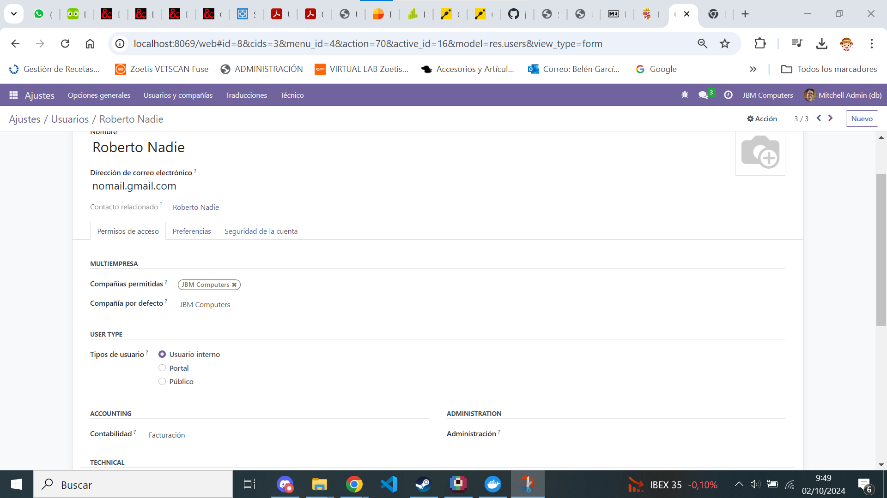

[Tema03](../index.md)

# PR0301: Facturas con Odoo

--- 
[PR0301](https://vgonzalez165.github.io/apuntes_sge/ut03_implantacion/pr0301.html)
En esta practica apendemos a crear una empresa, un cliente y una factura.

# Pasos realizados:

## Paso1:
Introducimos los datos de la empresa, entrando desde **ajustes** a compañias: Empresa de nombre JBM Computers, una empresa de material informatico.

## Paso2:
Entramos en **ajustes** y luego en usuarios, desde ahí creamos un nuevo **usuario**, en este caso *Roberto Nadie*, que solo tendrá permisos de ver y utilizar pero no administrar el modulo de facturación.

## Paso3:
Entramos en el módulo de **facturacion** de Odoo y entramos en la opcion de crear diseños de **facturas** donde configuramos:
1. El color del encabezado y el botón.
2. Añadimos un logotipo de empresa y una imagen de fondo para la factura.

3. Nos vamos a ajustes del módulo de **facturas**, en el apartado de pagos del cliente y activamos los QR.

## Paso4:
Entramos en el apartado de **clientes** del módulo de **facturación** e importamos un *archivo*, en este caso un [archivo](./clientes.csv) de tipo csv y asignamos los *datos* correspondientes.

## Paso5:
Le cambiamos la contraseña a *Roberto Nadie* accediendo a **usuarios**, buscando el usuario de *Roberto Nadie* y entramos en accion y **cambiar contraseña**, luego cerramos sesion y entramos con el *Usuario* de *Roberto* en el módulo de **facturación** y le damos a nueva *factura*.

Introducimos los datos que queramos y ya tenemos la [factura](./factura.pdf) deseada creada por un *usuario* no administrador.
