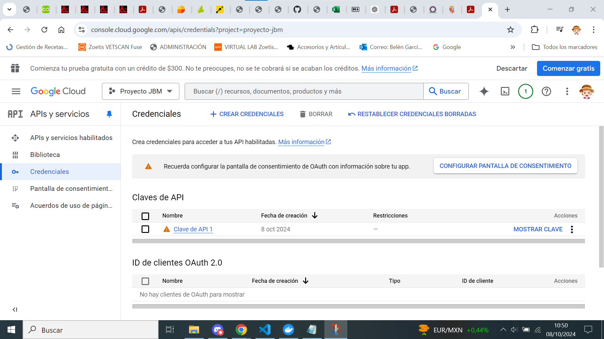

[Tema03](../index.md)

# PR0301: Facturas con Odoo

--- 
[PR0302](https://vgonzalez165.github.io/apuntes_sge/ut03_implantacion/pr0302.html)
En esta practica aperenderemos a usar una parte del módulo de **Inventario** en concreto la utilizacion de google imagenes para cargar automaticamente las imagenes de los productos.

## Paso 1:
Buscamos dentro de las aplicaciones el módulo de **inventario** y lo activamos 

## Paso 2:
Entramos en el módulo de inventario dentro de **productos** e importamos el [archivo](./libros.xls) con los libros en el módulo.

## Paso 3:
Ahora tenermos que habilitar la busqueda de google imagenes, para esto entramos en **Google APIs** y servicios y nos registramos para poder acceder al dashboard.

## Paso 4:
Creamos un proyecto y nos vamos al apartado de credenciales para crear una **API** Key. Aqui crearemos un nuevo proyecto, en este caso le he puesto Proyecto JBM.

Acto seguido nos vamos a credenciales, pinchamos en crear credenciales y luego clave **API**, Nos crea la clave(que no voy a mostrar) y ya la tenemos.

Pinchamos en la barra de busqueda y buscamos custom shearch **API**, pinchamos en el primer resultado y la habilitamos.

## Paso 5:
Ahora debemos asignar un *motor de busqueda* para esto iremos a esta [página](https://programmablesearchengine.google.com/about/) y pincharemos en **get Started** y luego en **añadir**.

Configuramos el *motor de busqueda* tal y como se muestra, puede buscar imágenes ahora además busca en toda la web.

Obtenemos la id de el motor de busqueda despues de pinchar en **personalizar** así obtenemos la **ID** de nuestro *buscador*.

## Paso 6:
Volvemos a godot, en concreto a **ajustes**, en el apartado de **integraciones** seleccionamos la caja de Google Imágenes guardamos, e introducimos tanto la **API** como la **ID** en 2 campos que deberian aparecer debajo de Google Imágenes y guardamos de nuevo.

## Paso 7:
Vamos al módulo de **inventario** de nuevo en el apartado de **productos** y pinchamos en el producto al que le queramos darle una imagen, luego pincharemos en **acción**, **obtener imágenes de google imágenes** y **obtener imágenes**

Con esto ya hemos obtenido la imagen autogenerada que deseabamos y podemos reproducir esto en todos nuestros productos.
