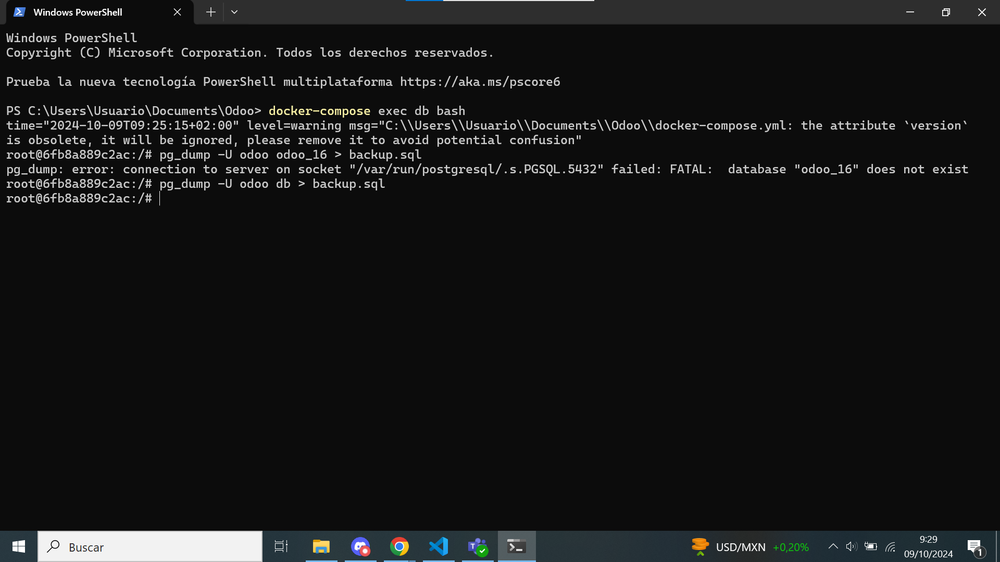
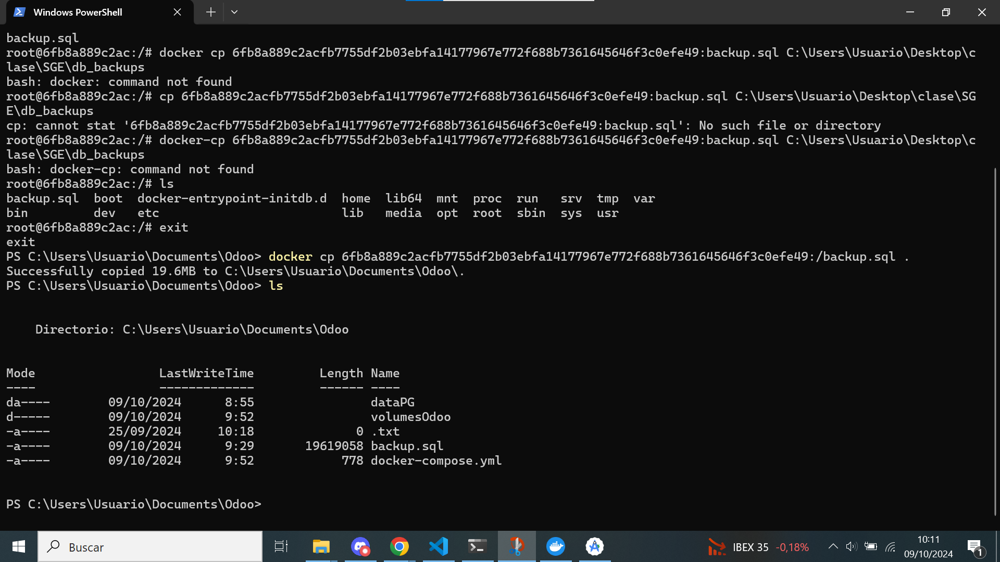
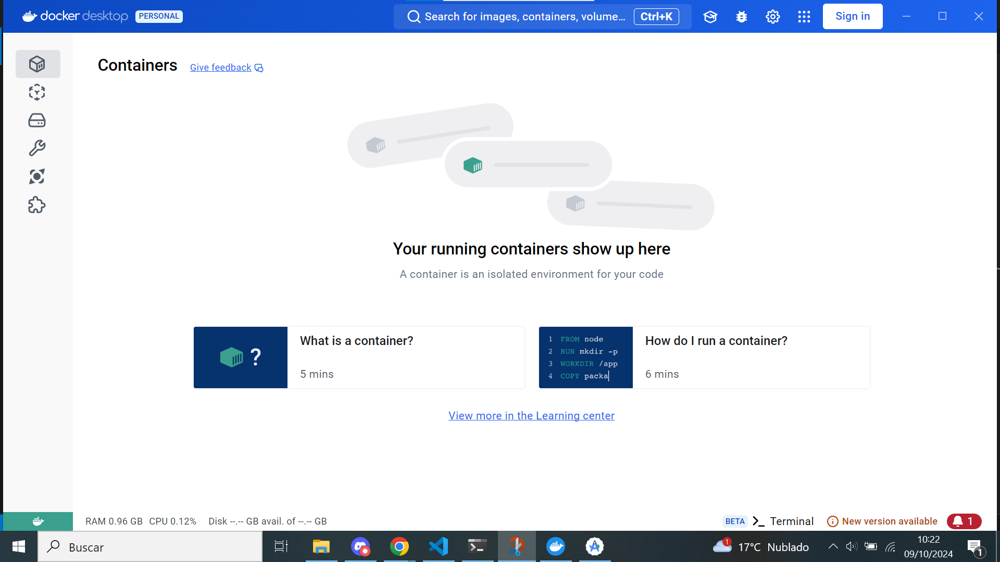
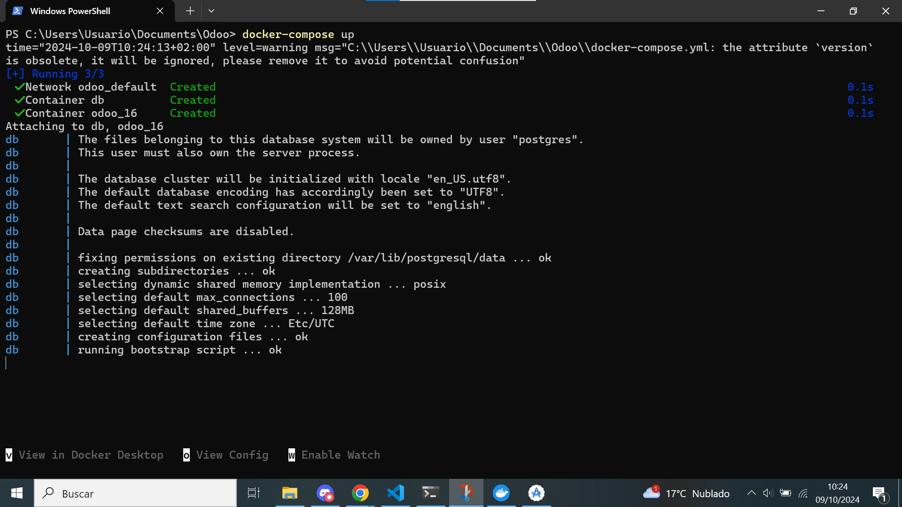
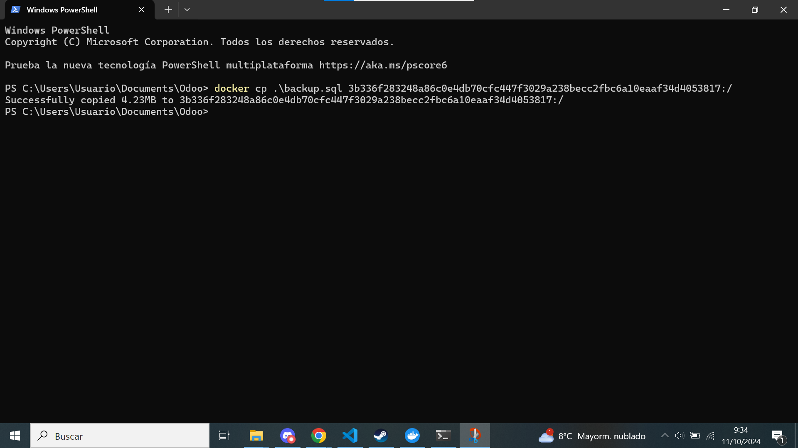
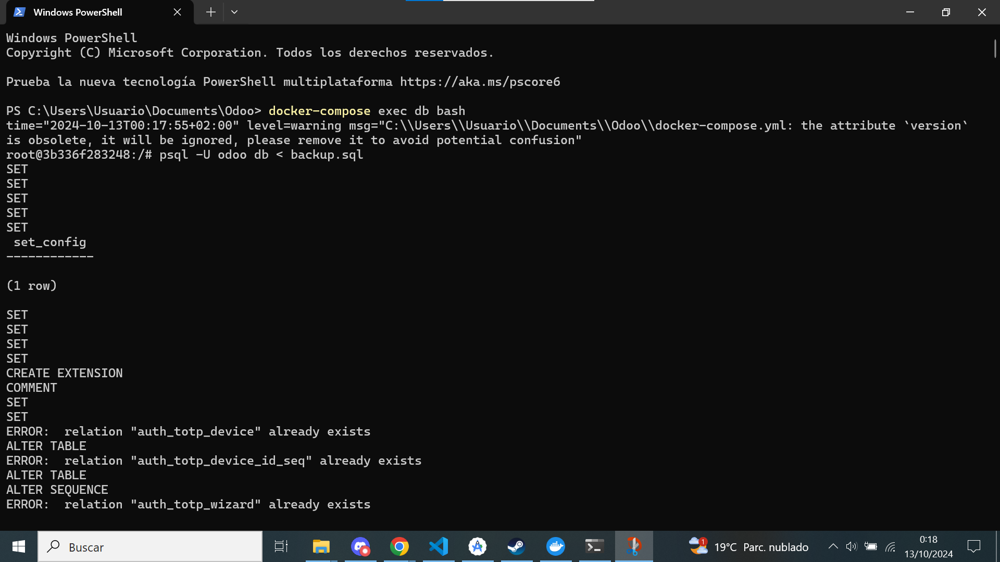

[Tema03](../index.md)

# PR0303: Copias de seguridad

--- 
[PR0303](https://vgonzalez165.github.io/apuntes_sge/ut03_implantacion/pr0303.html)
En esta práctica aprendemos a crear una copia de seguridad para nuestra base de datos de Odoo de diferentes formas.

## Paso 1:
Lo primero que debemos hacer es abrir una *terminal* donde tengamos el archivo **.yml** y la carpeta de **Odoo**, ahí ejecuataremos el comando *docker-compose exec db bash* nos dará un pequeño error pero no influye, ya estamos dentro de la máquina. Una vez dentro, ejecutamos el comando *pg_dump -U **usuario_de_la_db** **nombre_de_la_db** > backup.sql*.

## Paso 2:
A continuacion para poder sacar la copia de seguridad de a nuestro sistema ejecutamos: *docker cp 6fb8a889c2acfb7755df2b03ebfa14177967e772f688b7361645646f3c0efe49:/backup.sql .*, si ejecutamos ls comprobamos que la base de datos se ha portado satisfactoriamente.

## Paso 3:
Ahora borramos toda la informacion de las carpetas **DataPG** y **VolumesOdoo**, también borraremos todos los contenedores de **docker desktop**.

## Paso 4:
Levantamos de nuevo el *odoo* en docker con el comando **docker compose up**, el cual estará vacio, asque le tenemos que poner la *base de datos* de nuevo.

## Paso 5:
Usaremos de vuelta el comando **docker cp** en este caso con los argumentos **docker cp *localizacion de la base de datos* *id de la nueva base de datos + :/*** copiando así esta vez la base de datos en la nueva máquina.

## Paso 6:
Nos volvemos a meter dentro de la *base de datos del docker* de nuevo desde la *terminal*, ahí pondremos el comando **psql -U usuario + nombre de la base de datos < archivo con la copia de seguridad**, para crear de nuevo la base de datos y restaurarla.

## Paso 7:
Misión completada, todos los datos han sido *restaurados* y odoo vuelve a funcionar correctamente de nuevo.
