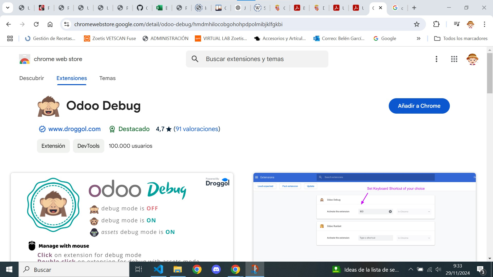
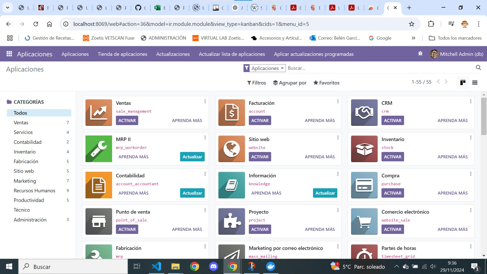
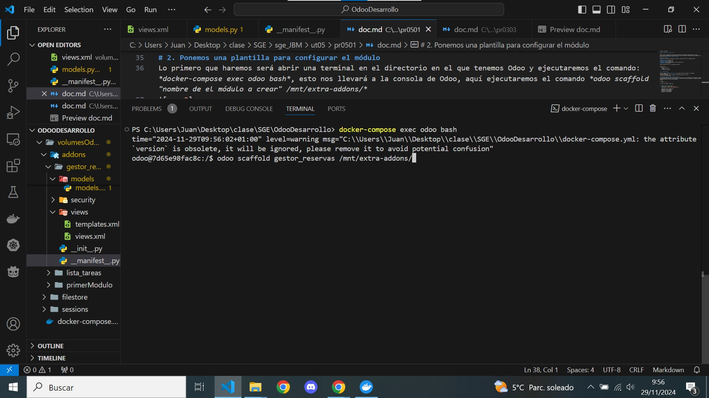

[Tema05](../index.md)

# PR0501: Creación de un módulo básico

--- 
[PR0501](https://vgonzalez165.github.io/apuntes_sge/ut05_creacion_modulos/pr0501_modulo_sencillo.html)
En esta práctica repasaremos los conceptos básicos de creación de módulos en Odoo mediante la implementación de un módulo sencillo de **Gestión de reserva de salas**.

## ¿Que vamos a hacer?
Crearemos un nuevo módulo de reservas de una empresa, cada reserva tendrá los siguientes campos:

**Nombre de la Sala**, de tipo texto.  
**Capacidad, de tipo** entero.  
**Fecha de Reserva**, de tipo fecha.  
**Reservada**, de tipo booleano,indicará si está disponible o no.  
**Comentarios** de tipo texto.  

También tendremos un menú con la siguiente estructura:

```
Gestión de salas:  
    Salas:  
        Salas disponibles.  
    Reservas:  
        Reservas realizadas.
```

# 1. Configurando Odoo

Entramos a google, buscamos **Odoo Debug**, seleccionamos el primer resultado y lo instalamos.

Acto seguido nos vamos a Odoo y comrpobamos que nuestros módulos ser vean así.


# 2. Ponemos una plantilla para configurar el módulo
Lo primero que haremos será abrir una terminal en el directorio en el que tenemos Odoo y ejecutaremos el comando: *docker-compose exec odoo bash*, esto nos llevará a la consola de Odoo, aquí ejecutaremos el comando *odoo scaffold "nombre de el módulo a crear" /mnt/extra-addons/*

Una vez hayamos hecho esto, se nos generará una estructura de archivos que nos permitirá generar más facilmente el nuevo módulo que vamos a crear

# 3. Archivos modificados.
De todos los archivos generados solo hemos modificado 3:  
**__manfiest__.py**  
**models.py**  
**views.xml**


```python
# models.py
# -*- coding: utf-8 -*-

from odoo import models, fields, api


class gestor_reservas(models.Model):
    _name = 'gestor_reservas.gestor_reservas'
    _description = 'gestor_reservas.gestor_reservas'

    nombre_de_la_sala = fields.Char()
    Capacidad = fields.Integer()
    fecha_reserva = fields.Date()
    reservada = fields.Boolean()
    comentarios = fields.Char()
```

```python
# __manifest__.py
# -*- coding: utf-8 -*-
{
    'name': "gestor_reservas",

    'summary': """
        Short (1 phrase/line) summary of the module's purpose, used as
        subtitle on modules listing or apps.openerp.com""",

    'description': """
        Long description of module's purpose
    """,

    'author': "Juan Blas Martínez",
    'website': "https://www.yourcompany.com",
    'application': True,

    # Categories can be used to filter modules in modules listing
    # Check https://github.com/odoo/odoo/blob/16.0/odoo/addons/base/data/ir_module_category_data.xml
    # for the full list
    'category': 'Administration',
    'version': '0.1',

    # any module necessary for this one to work correctly
    'depends': ['base'],

    # always loaded
    'data': [
        'security/ir.model.access.csv',
        'views/views.xml',
        'views/templates.xml',
    ],
    # only loaded in demonstration mode
    'demo': [
        'demo/demo.xml',
    ],
}
```

```xml
<!-- views.xml -->
<odoo>
  <data>
    <!-- explicit list view definition -->
    <record model="ir.ui.view" id="gestor_reservas.list">
      <field name="name">Gestor_reservas list</field>
      <field name="model">gestor_reservas.gestor_reservas</field>
      <field name="arch" type="xml">
        <tree>
          <field name="nombre_de_la_sala"/>
          <field name="Capacidad"/>
          <field name="fecha_reserva"/>
          <field name="reservada"/>
          <field name="comentarios"/>
        </tree>
      </field>
    </record>

    <!-- actions opening views on models -->
    <record model="ir.actions.act_window" id="gestor_reservas.action_window">
      <field name="name">Gestor_reservas window</field>
      <field name="res_model">gestor_reservas.gestor_reservas</field>
      <field name="view_mode">tree,form</field>
    </record>

    <!-- server action to the one above -->
    <record model="ir.actions.server" id="gestor_reservas.action_server">
      <field name="name">Gestor_reservas server</field>
      <field name="model_id" ref="model_gestor_reservas_gestor_reservas"/>
      <field name="state">code</field>
      <field name="code">
        action = {
          "type": "ir.actions.act_window",
          "view_mode": "tree,form",
          "res_model": model._name,
        }
      </field>
    </record>

    <!-- Top menu item -->
    <menuitem name="Gestión de salas" id="gestor_reservas.menu_root"/>

    <!-- menu categories -->
    <menuitem name="Salas" id="gestor_reservas.menu_salas" parent="gestor_reservas.menu_root"/>
    <menuitem name="Reservas" id="gestor_reservas.menu_reservas" parent="gestor_reservas.menu_root"/>

    <!-- actions -->
    <menuitem name="Salas disponibles" id="gestor_reservas.menu_1_list" parent="gestor_reservas.menu_salas"
              action="gestor_reservas.action_window"/>
    <menuitem name="Reservas realizadas" id="gestor_reservas" parent="gestor_reservas.menu_reservas"
              />
  </data>
</odoo>
```     