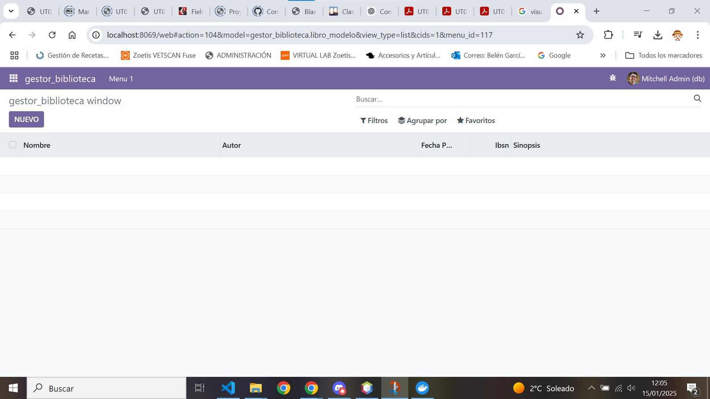

archivos modificados:  
[Tema05](../index.md)

# PR0502: Preparación del entorno con Docker

---     
[PR0502](https://vgonzalez165.github.io/apuntes_sge/ut05_creacion_modulos/pr0502_modulo_dos_modelos.html)
En esta práctica vamos a ver si te han quedado claros los conceptos sobre Docker, para lo que agregaremos un tercer contenedor con pgAdmin para poder administrar la base de datos con un **entorno gráfico**.

## ¿Que vamos a hacer?
En esta ocasión vamos a crear un módulo de gestión de biblioteca que contendrá dos modelos, uno para almacenar los autores y otro para los libros. Esto implica que nuestro módulo tendrá dos modelos, y, de forma análoga tendrá una vista para cada modelo.

# 1. Configuración de la plantilla del módulo
Lo primero que haremos será abrir una terminal en el directorio en el que tenemos Odoo y ejecutaremos el comando: *docker-compose exec odoo bash*, esto nos llevará a la consola de Odoo, aquí ejecutaremos el comando *odoo scaffold "nombre de el módulo a crear" /mnt/extra-addons/*

Una vez hayamos hecho esto, se nos generará una estructura de archivos que nos permitirá generar más facilmente el nuevo módulo que vamos a crear.

# 2. Editamos los modelos del módulo
Editaremos los modelos del módulo y crearemos nuevos si es necesario, en este caso hemos creado los modelos **autor_modelo** y **libro_modelo** dentro de la carpeta models.  
  
Le añadimos los campos necesarios a autor con los tipos correspondientes:

* nombre de tipo Char
* fecha_nac de tipo Date
* biografía de tipo Text
* libros de tipo Text  

  

Le añadimos los campos necesarios tambien al libro de los tipos correspondientes:

* nombre de tipo Char
* autor de tipo Char
* fecha_publicacion de tipo Date
* ISBN de tipo Integer
* sinopsis de tipo Text  

  

Una vez tenemos esto añadimos los nuevos modelos al init de la carpeta de modelos, con el nombre de los archivos.
  

# 3. Editamos el archivo de seguridad
Introducimos una linea de código por cada modelo que hayamos introducido con el siguiente formato:

**id_del_acceso(creado por nosotros),*nombre_del_modulo*.*nombre_del_modelo*,model_*nombre_del_modulo*_*nombre_del_modelo,base.group_user,1,1,1,1**

  

# 4. Modificación de las vistas:

Nos movemos ahora a las vistas, lo primero que haremos será restructurarlo, dividiendolas en vistas y menús siendo en este caso el menú **menus_vista** y las otras dos siendo las vistas normales.

  

Dentro de estas meteremos el siguiente código:

Este es el código de los menús de acceso al módulo:
```xml

<odoo>
  <data>

    <!-- Top menu item -->

    <menuitem name="gestor_biblioteca" id="gestor_biblioteca.menu_root"/>

    <!-- menu categories -->

    <menuitem name="Menu 1" id="gestor_biblioteca.menu_1" parent="gestor_biblioteca.menu_root"/>

    <!-- actions -->

    <menuitem name="autor" id="gestor_biblioteca.menu_1_list" parent="gestor_biblioteca.menu_1"
              action="gestor_biblioteca.action_window_autor"/>
    <menuitem name="libros" id="gestor_biblioteca.menu_2_list" parent="gestor_biblioteca.menu_1"
              action="gestor_biblioteca.action_window_libro"/>

  </data>
</odoo>

```

Hemos eliminado una de las categorias del menú para sustituirlo por un acceso único desde el cual cambiar las vistas desde el menú.

Este es el código que debemos poner en la vista del autor para que pueda ser visualizado:

Modelo del libro
``` xml
<odoo>
  <data>
    <!-- explicit list view definition -->

    <record model="ir.ui.view" id="gestor_biblioteca.list">
      <field name="name">gestor_biblioteca list</field>
      <field name="model">gestor_biblioteca.libro_modelo</field>
      <field name="arch" type="xml">
        <tree>
          <field name="nombre"/>
          <field name="autor"/>
          <field name="fecha_publicacion"/>
          <field name="IBSN"/>
          <field name="sinopsis"/>
        </tree>
      </field>
    </record>

    <!-- actions opening views on models -->

    <record model="ir.actions.act_window" id="gestor_biblioteca.action_window_libro">
      <field name="name">gestor_biblioteca window</field>
      <field name="res_model">gestor_biblioteca.libro_modelo</field>
      <field name="view_mode">tree,form</field>
    </record>

  </data>
</odoo>
```

Modelo del autor
``` xml
<odoo>
  <data>
    <!-- explicit list view definition -->

    <record model="ir.ui.view" id="gestor_biblioteca.autor_list">
      <field name="name">gestor_biblioteca list</field>
      <field name="model">gestor_biblioteca.autor_modelo</field>
      <field name="arch" type="xml">
        <tree>
          <field name="nombre"/>
          <field name="fecha_nac"/>
          <field name="biografia"/>
          <field name="libros"/>
        </tree>
      </field>
    </record>


    <!-- actions opening views on models -->

    <record model="ir.actions.act_window" id="gestor_biblioteca.action_window_autor">
      <field name="name">gestor_biblioteca window</field>
      <field name="res_model">gestor_biblioteca.autor_modelo</field>
      <field name="view_mode">tree,form</field>
    </record>


  </data>
</odoo>
```

Hemos modificado tanto el codigo de las vistas autor como libro, cambiando el tree para que se adapte a los modelos que modificamos anteriormente, también modificamos el campo del modelo para que identifique el modelo correcto.
Por ultimo modificamos las acciones para poder acceder a las listas a través de los nombres de los modelos a los que va a acceder al pincharle a la vista a la que queremos acceder.  

Finalmente accedemos al fichero manifest.py y añadimos las vistas al apartado de data para que odoo las pueda cargar.  


# 5. Comprobar que funciona:

Si ahora accedemos al módulo y lo actualizamos veremos que nuestas vistas ya funcionan.


