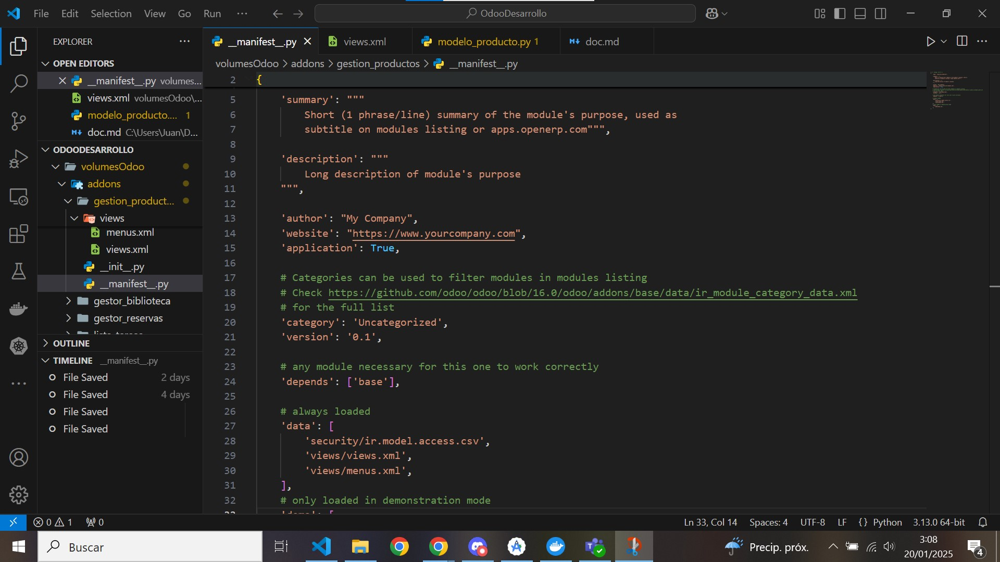

[Tema06](../index.md)

# PR0601: Preparación del entorno con Docker

---     
[PR0601](https://vgonzalez165.github.io/apuntes_sge/ut06_mvc_herencia/pr0601_campos_modelo.html)
En esta práctica vamos a ir viendo los campos más básicos del modelo.

## ¿Que vamos a hacer?
Desarrolla un módulo en Odoo llamado gestion_productos que permita gestionar una lista de productos.

# 1. Editamos el modelo del módulo
Editaremos los modelos del módulo para acomodarlo a los datos que se nos piden.
  
Le añadimos los campos necesarios al modelo con los tipos correspondientes:

* nombre de tipo Char
* descripcion de tipo Text
* cod_producto de tipo Integer
* imagen de tipo Image  
* categoria de tipo Selection
* tipo_de_producto de tipo Boolean
* precio de tipo Float
* stock_disponible de tipo Integer  
* fecha_de_creacion de tipo Date
* fecha_de_actualizacion de tipo Date
* activo de tipo Boolean
* peso_del_producto de tipo Float  

Una vez tenemos esto añadimos los nuevos modelos al init de la carpeta de modelos, con el nombre de los archivos.
  

# 2. Editamos el archivo de seguridad
Introducimos una linea de código por cada modelo que hayamos introducido con el siguiente formato:

**id_del_acceso(creado por nosotros),*nombre_del_modulo*.*nombre_del_modelo*,model_*nombre_del_modulo*_*nombre_del_modelo,base.group_user,1,1,1,1**

  

# 3. Modificación de las vistas:

Nos movemos ahora a las vistas, lo primero que haremos será restructurarlo, dividiendolas en vistas y menús siendo en este caso el menú **menus_vista** y las otras dos siendo las vistas normales.

  

Dentro de estas meteremos el siguiente código:

Este es el código de los menús de acceso al módulo:
```xml

<odoo>
  <data>
    <!-- Top menu item -->

    <menuitem name="gestion_productos" id="gestion_productos.menu_root"/>

    <!-- menu categories -->

    <menuitem name="Menu 1" id="gestion_productos.menu_1" parent="gestion_productos.menu_root"/>

    <!-- actions -->

    <menuitem name="List" id="gestion_productos.menu_1_list" parent="gestion_productos.menu_1"
              action="gestion_productos.action_window"/>
  </data>
</odoo>

```

Hemos eliminado una de las categorias del menú para sustituirlo por un acceso único desde el cual cambiar las vistas desde el menú.

Este es el código que debemos poner en la vista de los productos para que pueda ser visualizado:

Modelo de productos
``` xml

<odoo>
  <data>
    <!-- explicit list view definition -->

    <record model="ir.ui.view" id="gestion_productos.list">
      <field name="name">gestion_productos list</field>
      <field name="model">gestion_productos.modelo_producto</field>
      <field name="arch" type="xml">
        <tree>
          <field name="nombre"/>
          <field name="descripcion"/>
          <field name="cod_producto"/>
          <field name="imagen"/>
          <field name="categoria"/>
          <field name="tipo_de_producto"/>
          <field name="precio"/>
          <field name="stock_disponible"/>
          <field name="fecha_de_creacion"/>
          <field name="fecha_actualizacion"/>
          <field name="categoria"/>
          <field name="tipo_de_producto"/>
        </tree>
      </field>
    </record>


    <!-- actions opening views on models -->

    <record model="ir.actions.act_window" id="gestion_productos.action_window">
      <field name="name">gestion_productos window</field>
      <field name="res_model">gestion_productos.modelo_producto</field>
      <field name="view_mode">tree,form</field>
    </record>
  </data>
</odoo>

```

Hemos modificado el codigo de las vistas, cambiando el tree para que se adapte a los modelos que modificamos anteriormente, también modificamos el campo del modelo para que identifique el modelo correcto.
Por ultimo modificamos las acciones para poder acceder a las listas a través de los nombres de los modelos a los que va a acceder al pincharle a la vista a la que queremos acceder.  

Finalmente accedemos al fichero manifest.py y añadimos las vistas al apartado de data para que odoo las pueda cargar.  



# 5. Comprobar que funciona:

Si ahora accedemos al módulo y lo actualizamos veremos que nuestas vistas ya funcionan.

