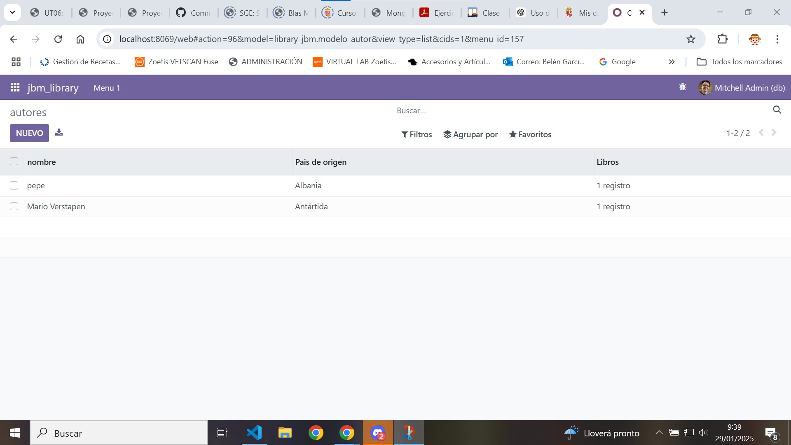
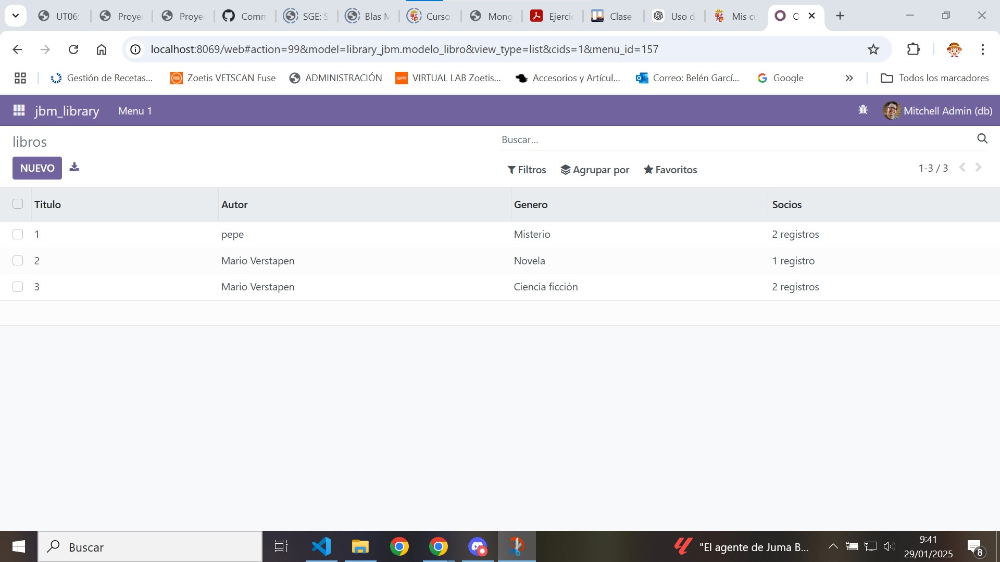
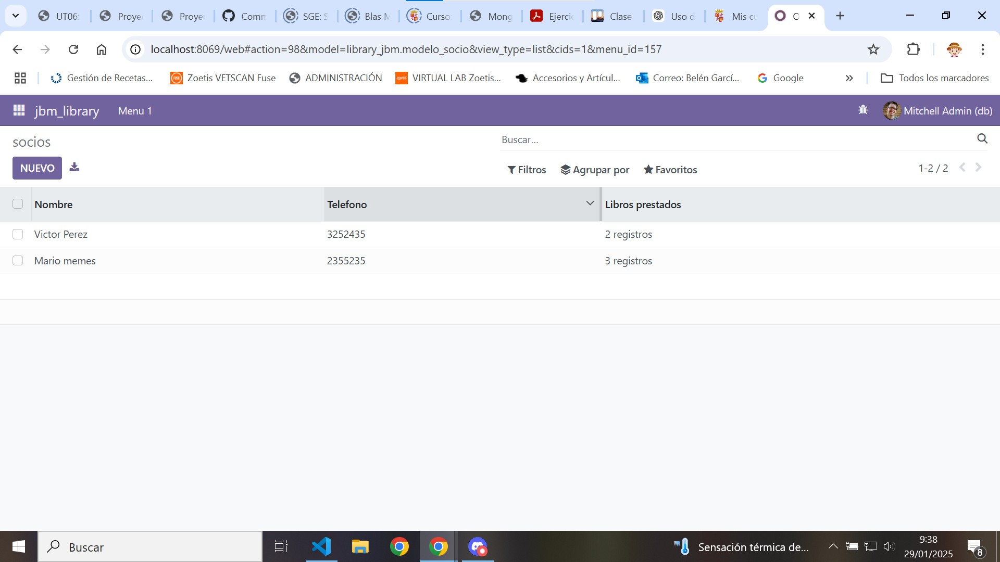

[Tema06](../index.md)

# PR0602: Campos del modelo

---     
[PR0602](https://vgonzalez165.github.io/apuntes_sge/ut06_mvc_herencia/pr0602_campos_relacionales.html)

## ¿Que vamos a hacer?
Tienes que crear un módulo para la gestión de una biblioteca, similar al que ya creamos en una práctica anterior pero enfatizando en los campos relacionales.


# 1. Editamos el modelo del módulo
Tenemos que añadir 3 modelos para que esto funcione, uno de **libros**, uno de **autores** y uno de **socios**, veamos como lo vamos a hacer:  

### Modelo autor

Primero crearemos el modelos de los autores dentro de la carpeta models, lo llamaremos **modelo_autor.py** y le añadiremos los campos necesarios:

* *nombre* de tipo Char
* *pais de origen* de tipo Many2one
* *libros* de tipo One2many

``` python
# -*- coding: utf-8 -*-

from odoo import models, fields, api


class modelo_autor(models.Model):
    _name = 'library_jbm.modelo_autor'
    _description = 'library_jbm.library_jbm'

    name = fields.Char(string='nombre')
    pais_origen = fields.Many2one(comodel_name='res.country', string='Pais de origen')
    libros = fields.One2many(comodel_name='library_jbm.modelo_libro', inverse_name='titulo')
```

En este caso hemos puesto en campo Many2one en el pais de origen que se conecta con el modelo local de odoo **res.country** este nos permite elegir de una lista de paises ya creada.  
También hemos puesto el campo One2many en libros porque un autor puede tener varios libros. Este se conecta con el **modelo libro** y nos mostrará el titulo de ese libro.

### Modelo libro

Creamos el modelo dentro de la carpeta models, lo llamaremos **modelo_libro** y le añadiremos también los campos necesarios:

* *titulo* de tipo Char
* *autor* de tipo Many2one
* *genero* de tipo Selection, contiene los generos disponibles.
* *socios* de tipo Many2many

``` python
# -*- coding: utf-8 -*-

from odoo import models, fields, api


class modelo_libro(models.Model):
    _name = 'library_jbm.modelo_libro'
    _description = 'library_jbm.library_jbm'

    titulo = fields.Char()
    autor = fields.Many2one(comodel_name='library_jbm.modelo_autor')
    genero = fields.Selection([
        ('novela', 'Novela'),
        ('drama', 'Drama'),
        ('ciencia_ficcion', 'Ciencia ficción'),
        ('misterio', 'Misterio'),
        ('terror', 'Terror'),
        ('historico', 'Historico')
        ]
    )
    socios = fields.Many2many('library_jbm.modelo_socio')
```

Ahora tenemos un campo Many2one en el **titulo** que se conecta con el **modelo_autor** para indicar que solo puede hacer un *autor* asignado a cada *libro*.  
También tenemos un campo Many2many en **socios** que se conecta con el **modelo_socio** para indicar que un *socio* puede alquilar varios *libros* y un *libro* puede ser alquilado por varios *socios*.

### Modelo socios

Creamos el modelo dentro de la carpeta models, lo llamaremos **modelo_socio** y le añadiremos también los campos necesarios:

* *nombre* de tipo Char
* *telefono* de tipo Char
* *libros* de tipo Many2many

``` python
# -*- coding: utf-8 -*-

from odoo import models, fields, api


class modelo_socio(models.Model):
    _name = 'library_jbm.modelo_socio'
    _description = 'library_jbm.library_jbm'

    nombre = fields.Char()
    telefono = fields.Char()
    libros = fields.Many2many('library_jbm.modelo_libro', string='Libros prestados')
```


Tenemos un campo Many2many en **libros** que se conecta con el **modelo_libro** para indicar que un *socio* puede alquilar varios *libros* y un *libro* puede ser alquilado por varios *socios*.

# 2. Editamos el archivo __init__.py

Le añadimos las importaciones de los nuevos modelos al archivo de **__init__.pyt** para que odoo pueda  acceder a los modelos que hemos creado hace un momento.

``` python
# -*- coding: utf-8 -*-

from . import modelo_socio, modelo_autor, modelo_libro
```

# 3. Editamos el archivo de seguridad
Editamos el archivo ir.model.access.csv para que registre los nuevos modelos que hemos creado en la base de datos de odoo.

```
id,name,model_id:id,group_id:id,perm_read,perm_write,perm_create,perm_unlink
access_library_jbm_autor,library_jbm.modelo_autor,model_library_jbm_modelo_autor,base.group_user,1,1,1,1
access_library_jbm_libro,library_jbm.modelo_libro,model_library_jbm_modelo_libro,base.group_user,1,1,1,1
access_library_jbm_socio,library_jbm.modelo_socio,model_library_jbm_modelo_socio,base.group_user,1,1,1,1
```

# 4. Creamos nuevos archivos en la carpeta de views
Crearemos 4 nuevos archivos xml en la carpeta de views un archivo con los menús, y tres archivos con las vistas de cada modelo generado.

### Vista de autores:
``` xml

<odoo>
  <data>
    <!-- explicit list view definition -->

    <record model="ir.ui.view" id="library_jbm.autor_list">
      <field name="name">Autores</field>
      <field name="model">library_jbm.modelo_autor</field>
      <field name="arch" type="xml">
        <tree>
          <field name="name"/>
          <field name="pais_origen"/>
          <field name="libros"/>
        </tree>
      </field>
    </record>


    <!-- actions opening views on models -->

    <record model="ir.actions.act_window" id="library_jbm.autores_action_window">
      <field name="name">autores</field>
      <field name="res_model">library_jbm.modelo_autor</field>
      <field name="view_mode">tree,form</field>
    </record>
  </data>
</odoo>

```
Ponemos la id de la vista como *nombre_del_modulo.lo_que_queramos* en este caso **library_jbm.autor_list** el nombre que queramos **Autores**, el model de la vista en este caso **library_jbm.modelo_autor**, los campos con los nombres de los elementos del modelo **name**, **pais_origen** y **libros**.  
En las acciones de la vista pondremos la id, el nombre y el res_model:  
La **id** será la que queramos, el **name** también y el **res_model** será el modelo que queremos que aparezca al seleccionar esa vista, es decir, el que ya pusimos en la propia vista, en este caso **library_jbm.modelo_autor**  

### Vista de libro:
Haremos lo mismo que hicimos en la anterior vista.
``` xml
<odoo>
  <data>
    <!-- explicit list view definition -->

    <record model="ir.ui.view" id="library_jbm.libro_list">
      <field name="name">Socios</field>
      <field name="model">library_jbm.modelo_libro</field>
      <field name="arch" type="xml">
        <tree>
          <field name="titulo"/>
          <field name="autor"/>
          <field name="genero"/>
          <field name="socios"></field>
        </tree>
      </field>
    </record>


    <!-- actions opening views on models -->

    <record model="ir.actions.act_window" id="library_jbm.libros_action_window">
      <field name="name">libros</field>
      <field name="res_model">library_jbm.modelo_libro</field>
      <field name="view_mode">tree,form</field>
    </record>
  </data>
</odoo>
```
### Vista de socio:
Y volveremos a hacer lo mismo en esta vista.
``` xml
<odoo>
  <data>
    <!-- explicit list view definition -->

    <record model="ir.ui.view" id="library_jbm.socio_list">
      <field name="name">Socios</field>
      <field name="model">library_jbm.modelo_socio</field>
      <field name="arch" type="xml">
        <tree>
          <field name="nombre"/>
          <field name="telefono"/>
          <field name="libros"/>
        </tree>
      </field>
    </record>


    <!-- actions opening views on models -->

    <record model="ir.actions.act_window" id="library_jbm.socios_action_window">
      <field name="name">socios</field>
      <field name="res_model">library_jbm.modelo_socio</field>
      <field name="view_mode">tree,form</field>
    </record>
  </data>
</odoo>
```

### Vista de menus:
En la vista de menús pondremos un menuitem con las acciones necesarias para acceder a cada una de las vistas, debemos poner en cada una de estas acciones la id de la accion correspondiente que pusimos en la vista.
``` xml
<odoo>
  <data>

    <!-- Top menu item -->

    <menuitem name="jbm_library" id="library_jbm.menu_root"/>

    <!-- menu categories -->

    <menuitem name="Menu 1"
        id="library_jbm.menu_1" 
        parent="library_jbm.menu_root"/>

    <!-- actions -->

    <menuitem name="autores" 
        id="library_jbm.menu_1_list"
        parent="library_jbm.menu_1"
        action="library_jbm.autores_action_window"/>
    <menuitem name="socios" 
        id="library_jbm.menu_2_list"
        parent="library_jbm.menu_1"
        action="library_jbm.socios_action_window"/>
    <menuitem name="libros" 
        id="library_jbm.menu_3_list"
        parent="library_jbm.menu_1"
        action="library_jbm.libros_action_window"/>
  </data>
</odoo>
```

# 5. Modificamos el archivo manifest:
Para que todo lo que hemos hecho cargue debemos descomentar el archivo de security.csv en data para que pueda cargar la base de datos y también debemos añadir las vistas que hemos creado, quedando así el archivo:
``` python
# -*- coding: utf-8 -*-
{
    'name': "library_jbm",

    'summary': """
        Short (1 phrase/line) summary of the module's purpose, used as
        subtitle on modules listing or apps.openerp.com""",

    'description': """
        Long description of module's purpose
    """,

    'author': "My Company",
    'website': "https://www.yourcompany.com",
    'application': True,

    # Categories can be used to filter modules in modules listing
    # Check https://github.com/odoo/odoo/blob/16.0/odoo/addons/base/data/ir_module_category_data.xml
    # for the full list
    'category': 'Uncategorized',
    'version': '0.1',

    # any module necessary for this one to work correctly
    'depends': ['base'],

    # always loaded
    'data': [
        'security/ir.model.access.csv',
        'views/vista_autor.xml',
        'views/vista_socio.xml',
        'views/vista_libro.xml',
        'views/menus.xml',
    ],
    # only loaded in demonstration mode
    'demo': [
        'demo/demo.xml',
    ],
}
```

# 6. Comprobamos que ha funcionado:
Comprobamos que hemos podido añadir nuevos socios, libros y autores que cumplen sus respectivas referencias en estas imágenes:
 
 
 