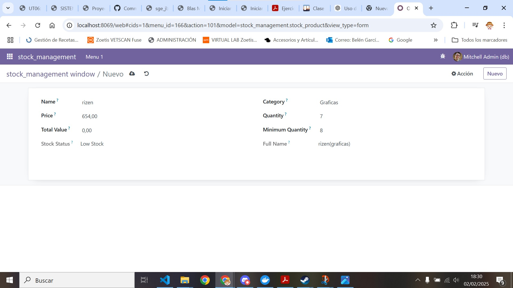
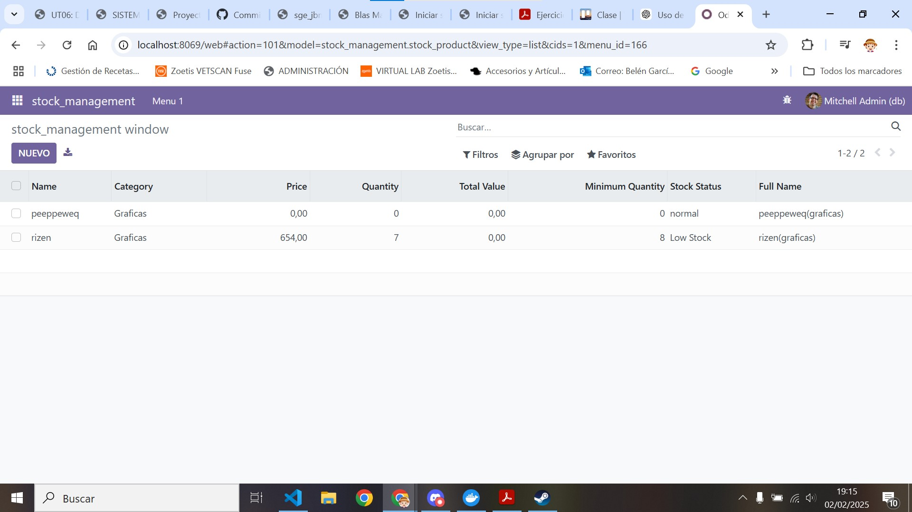

[Tema06](../index.md)

# PR0603: Campos calculados y restricciones

---     
[PR0603](https://vgonzalez165.github.io/apuntes_sge/ut06_mvc_herencia/pr0603_campos_calculados_restricciones.html)

## ¿Que vamos a hacer?
En este ejercicio practicarás con campos calculados y con restricciones en el modelo, tanto SQL como Python.


# 1. Editamos el modelo del módulo
Tenemos que añadir 1 modelo para que esto funcione, uno de **stock_product**.

### Modelo autor

Primero crearemos el modelo de los susbcriptores dentro de la carpeta models, lo llamaremos **stock_product.py** y le añadiremos los campos necesarios:

* *name* de tipo Char
* *category de origen* de tipo Selection
* *price* de tipo Float
* *quantity* de tipo Integer
* *total_value* de tipo Float
* *minimum_quantity* de tipo Integer
* *stock_status* de tipo Selection
* *full_name* de tipo Char

``` python
# -*- coding: utf-8 -*-

from odoo import models, fields, api
from odoo.exceptions import  ValidationError


class stock_product(models.Model):
    _name = 'stock_management.stock_product'
    _description = 'stock_management.stock_product'
    _sql_constraints = [
        ('unique_name', 'unique(name)', "El nombre debe ser único"),
        ('check_stock', 'CHECK(stock > 0)', 'El stock debe ser mayor de 0')
    ]


    name = fields.Char()
    category = fields.Selection([
        ('microprocesadores', 'Microprocesadores'),
        ('graficas', 'Graficas'),
        ('moviles', 'Moviles')
    ])
    price = fields.Float()
    quantity = fields.Integer()
    total_value = fields.Float()
    minimum_quantity = fields.Integer()
    stock_status = fields.Selection([
        ('normal_status', 'normal'),
        ('low_status', 'Low Stock')
    ],compute="_status_calculation")
    full_name = fields.Char(compute="_name_calculation")


    @api.constrains('price')
    def _price_restriccion(self):
        for record in self:
            if record.price <= 0:
                raise ValidationError('El precio debe ser mayor de 0')
    
    @api.constrains('quantity')
    def _quantity_restriccion(self):
        for record in self:
            if record.quantity < 0:
                raise ValidationError('La cantidad debe ser mayor a 0')
            
    @api.constrains('total_value')
    def _total_restriccion(self):
        for record in self:
            if record.total_value > 100000:
                raise ValidationError('El valor total no puede ser mayor de 100000')
            
    @api.constrains('category')
    def _category_restriccion(self):
        for record in self:
            if not record.category:
                raise ValidationError('La categoría no puede estar vacia')

    @api.depends('quantity', 'minimum_quantity')
    def _status_calculation(self):
        for product in self:
            if product.quantity < product.minimum_quantity:
                product.stock_status = 'low_status'
            else:
                product.stock_status = 'normal_status'

    @api.depends('name', 'category')
    def _name_calculation(self):
        for product in self:
            nombre = product.name or ''
            categoria = product.category or ''
            product.full_name = nombre + '(' + categoria + ')'
```

Hemos hecho un par de modificaciones para que las restricciones en la parte de arriba le hemos inicado que el nombre debe ser único y el stock debe ser menor de 0.  
También añadimos un par de restricciones de paython para:
Que el precio sea mayor de 0.  
Que la cantidad sea mayor de 0.  
Que el valor total no sea mayor de 100000.  
Que la categoría no esté vacia.  
  
Por último le añadimos los campos calculados de estatus que nos dice que si el stock es menos del stock minimo significa que tenmos poco stock.  
Y que el campo del nombre completo nos muestre la fusion de la categoría y el nombre combinadas.  

# 2. Editamos el archivo __init__.py

Le añadimos las importaciones de los nuevos modelos al archivo de **__init__.pyt** para que odoo pueda  acceder a los modelos que hemos creado hace un momento.  

``` python
# -*- coding: utf-8 -*-

from . import stock_product
```

# 3. Editamos el archivo de seguridad
Editamos el archivo ir.model.access.csv para que registre los nuevos modelos que hemos creado en la base de datos de odoo.

```
id,name,model_id:id,group_id:id,perm_read,perm_write,perm_create,perm_unlink
access_stock_management_stock_management,stock_management.stock_product,model_stock_management_stock_product,base.group_user,1,1,1,1
```

# 4. Creamos nuevos archivos en la carpeta de views
Crearemos 1 archivo xml de vista que muestre lo que hemos cambiado en el modelo.

### Vista de vista:
``` xml
<odoo>
  <data>
    <!-- explicit list view definition -->

    <record model="ir.ui.view" id="stock_management.list">
      <field name="name">stock_management list</field>
      <field name="model">stock_management.stock_product</field>
      <field name="arch" type="xml">
        <tree>
          <field name="name"/>
          <field name="category"/>
          <field name="price"/>
          <field name="quantity"/>
          <field name="total_value"/>
          <field name="minimum_quantity"/>
          <field name="stock_status"/>
          <field name="full_name"/>
        </tree>
      </field>
    </record>


    <!-- actions opening views on models -->

    <record model="ir.actions.act_window" id="stock_management.action_window">
      <field name="name">stock_management window</field>
      <field name="res_model">stock_management.stock_product</field>
      <field name="view_mode">tree,form</field>
    </record>

    <!-- Top menu item -->

    <menuitem name="stock_management" id="stock_management.menu_root"/>

    <!-- menu categories -->

    <menuitem name="Menu 1" id="stock_management.menu_1" parent="stock_management.menu_root"/>
    <menuitem name="Menu 2" id="stock_management.menu_2" parent="stock_management.menu_root"/>

    <!-- actions -->

    <menuitem name="List" id="stock_management.menu_1_list" parent="stock_management.menu_1"
              action="stock_management.action_window"/>

  </data>
</odoo>
```

# 5. Modificamos el archivo manifest:
Para que todo lo que hemos hecho cargue debemos descomentar el archivo de security.csv en data para que pueda cargar la base de datos y también debemos añadir las vistas que hemos creado, quedando así el archivo:
``` python
# -*- coding: utf-8 -*-
{
    'name': "stock_management",

    'summary': """
        Short (1 phrase/line) summary of the module's purpose, used as
        subtitle on modules listing or apps.openerp.com""",

    'description': """
        Long description of module's purpose
    """,

    'author': "My Company",
    'website': "https://www.yourcompany.com",
    'application': True,

    # Categories can be used to filter modules in modules listing
    # Check https://github.com/odoo/odoo/blob/16.0/odoo/addons/base/data/ir_module_category_data.xml
    # for the full list
    'category': 'Uncategorized',
    'version': '0.1',

    # any module necessary for this one to work correctly
    'depends': ['base'],

    # always loaded
    'data': [
        'security/ir.model.access.csv',
        'views/views.xml',
    ],
    # only loaded in demonstration mode
    'demo': [
        'demo/demo.xml',
    ],
}
```

# 6. Comprobamos que ha funcionado:
Comprobamos que hemos podido añadir los nuevos campos con las referencias necesarias que cumplen sus respectivas referencias en estas imágenes:
 
 