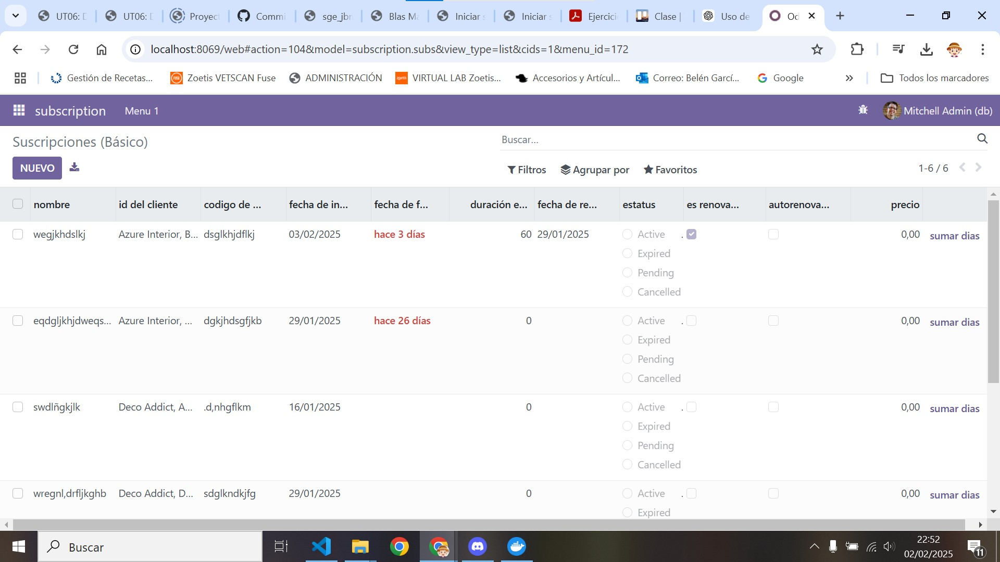
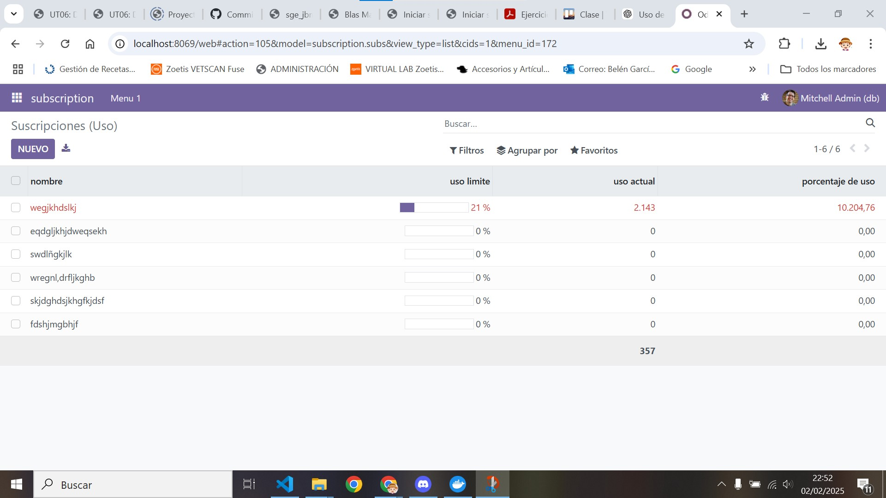

[Tema06](../index.md)

# PR0604: Vista de tipo lista

---     
[PR0604](https://vgonzalez165.github.io/apuntes_sge/ut06_mvc_herencia/pr0604_vista_tree.html)

## ¿Que vamos a hacer?
En esta primera práctica sobre vistas practicaremos con las principales opciones que tiene la vista de tipo lista para personalizar los datos que se muestran al usuario.


# 1. Editamos el modelo del módulo
Tenemos que añadir 1 modelo para que esto funcione, uno de **subs**.

### Modelo subs

Primero crearemos el modelos de los subscriptores dentro de la carpeta models, lo llamaremos **subs.py** y le añadiremos los campos necesarios:

* *name* de tipo Char
* *customer_id* de tipo Many2one
* *subscription_code* de tipo Char
* *start_date* de tipo Date
* *end_date* de tipo Date
* *duration_months* de tipo Integer
* *renewal_date* de tipo Date
* *status* de tipo Selection
* *is_renewable* de tipo Boolean
* *auto_renewal* de tipo Boolean
* *price* de tipo Float
* *usage_limit* de tipo Integer
* *current_usage* de tipo Integer
* *use_percent* de tipo Float

``` python
# -*- coding: utf-8 -*-

from odoo import models, fields, api


class subs(models.Model):
    _name = 'subscription.subs'
    _description = 'subscription.subscription'
    _sql_constraints = [
        ('unique_name', 'unique(name)', "El nombre debe ser único"),
    ]

    name = fields.Char(required=True)
    customer_id = fields.Many2one(required=True, comodel_name='res.partner')
    subscription_code = fields.Char(required=True)
    start_date = fields.Date(required=True)
    end_date = fields.Date()
    duration_months = fields.Integer()
    renewal_date = fields.Date()
    status = fields.Selection([
        ('active', 'Active'),
        ('expired', 'Expired'),
        ('pending', 'Pending'),
        ('cancelled', 'Cancelled')
    ])
    is_renewable = fields.Boolean()
    auto_renewal = fields.Boolean()
    price = fields.Float()
    usage_limit = fields.Integer()
    current_usage = fields.Integer()
    use_percent = fields.Float(compute='_percent_calculation')

    def boton(self):
        self.duration_months=self.duration_months + 15

    @api.depends('usage_limit', 'current_usage')
    def _percent_calculation(self):
        for record in self:
            if record.usage_limit:
                record.use_percent = (record.current_usage / record.usage_limit) * 100
            else:
                record.use_percent = 0
```

Hemos creado los campos necesarios para que el modulo funcione, también hemos añadido un campo calculado del porcentaje de uso.
También le hemos puesto una función al botón para que pueda añadir dias a la duración de meses.

# 2. Editamos el archivo __init__.py

Le añadimos las importaciones de los nuevos modelos al archivo de **__init__.pyt** para que odoo pueda  acceder a los modelos que hemos creado hace un momento.  

``` python
# -*- coding: utf-8 -*-

from . import subs
```

# 3. Editamos el archivo de seguridad
Editamos el archivo ir.model.access.csv para que registre los nuevos modelos que hemos creado en la base de datos de odoo.

```
id,name,model_id:id,group_id:id,perm_read,perm_write,perm_create,perm_unlink
access_subscription_subscription,subscription.subs,model_subscription_subs,base.group_user,1,1,1,1
```

# 4. Creamos nuevos archivos en la carpeta de views
Crearemos 3 archivos xml de vista que muestre lo que hemos cambiado en el modelo y un menú.

### Vista de basics:
``` xml
<odoo>
  <data>
    <!-- explicit list view definition -->

    <record model="ir.ui.view" id="view_subscription_tree_basic">
      <field name="name">subscription basic</field>
      <field name="model">subscription.subs</field>
      <field name="arch" type="xml">
        <tree limit='15' decoration-danger='status == "expired"' decoration-warning='status == "cancelled"'>
          <field name="name" string='nombre'/>
          <field name="customer_id" string='id del cliente'/>
          <field name="subscription_code" string='codigo de subscripción'/>
          <field name="start_date" string='fecha de inicio'/>
          <field name="end_date" string='fecha de fin' widget = 'remaining_days'/>
          <field name="duration_months" string='duración en meses'/>
          <field name="renewal_date" string='fecha de renovación'/>
          <field name="status" string='estatus' widget = 'radio'/>
          <field name="is_renewable" string='es renovable'/>
          <field name="auto_renewal" string='autorenovación'/>
          <field name="price" string='precio' attrs = "{'invisible':[('status', '=', 'expired')]}"/>
          <button name="boton" type = 'object' string="sumar dias" class='oe_high_light'/>
        </tree>
      </field>
    </record>

    <!-- actions opening views on models -->

    <record id="action_subscription_basic" model="ir.actions.act_window">
        <field name="name">Suscripciones (Básico)</field>
        <field name="res_model">subscription.subs</field>
        <field name="view_mode">tree,form</field>
        <field name="view_id" ref="view_subscription_tree_basic"/>
    </record>
  </data>
</odoo>
```

### Vista de usage:

``` xml
<odoo>
  <data>
    <!-- explicit list view definition -->

    <record model="ir.ui.view" id="view_subscription_tree_usage">
      <field name="name">subscription usage</field>
      <field name="model">subscription.subs</field>
      <field name="arch" type="xml">
        <tree limit="15" decoration-danger="use_percent &gt; 80">
          <field name="name" string='nombre'/>
          <field name="usage_limit" string='uso limite' widget='progressbar'/>
          <field name="current_usage" string='uso actual' avg='1'/>
          <field name="use_percent" string='porcentaje de uso'/>
        </tree>
      </field>
    </record>


    <!-- actions opening views on models -->

    <record id="action_subscription_usage" model="ir.actions.act_window">
        <field name="name">Suscripciones (Uso)</field>
        <field name="res_model">subscription.subs</field>
        <field name="view_mode">tree,form</field>
        <field name="view_id" ref="view_subscription_tree_usage"/>
    </record>
  </data>
</odoo>
```

### Vista de menu:

``` xml
<odoo>
  <data>
    <!-- Top menu item -->

    <menuitem name="subscription" id="subscription.menu_root"/>

    <!-- menu categories -->

    <menuitem name="Menu 1" id="subscription.menu_1" parent="subscription.menu_root"/>

    <!-- actions -->

    <menuitem name="Basics" id="subscription.menu_1_list" parent="subscription.menu_1"
              action="action_subscription_basic"/>
    <menuitem name="Usage" id="subscription.menu_2_list" parent="subscription.menu_1"
              action="action_subscription_usage"/>
  </data>
</odoo>
```

Le hemos dado a las vistas los respectivos cambios para que se pueda mover el usuario con el menú.
También le hemos dado una serie de widgets (algunos con funcionalidad para que el usuario pueda interactuar con la interfaz)
Y le hemos añadido una serie de decoration warnings para que se pueda dar cuenta de los varios cambios realizados como al estatus, o el cambio a invisible del precio cuando se ha expirado el subscriptor.

# 5. Modificamos el archivo manifest:
Para que todo lo que hemos hecho cargue debemos descomentar el archivo de security.csv en data para que pueda cargar la base de datos y también debemos añadir las vistas que hemos creado, quedando así el archivo:
``` python
# -*- coding: utf-8 -*-
# -*- coding: utf-8 -*-
{
    'name': "subscription",

    'summary': """
        Short (1 phrase/line) summary of the module's purpose, used as
        subtitle on modules listing or apps.openerp.com""",

    'description': """
        Long description of module's purpose
    """,

    'author': "My Company",
    'website': "https://www.yourcompany.com",
    'application': True,

    # Categories can be used to filter modules in modules listing
    # Check https://github.com/odoo/odoo/blob/16.0/odoo/addons/base/data/ir_module_category_data.xml
    # for the full list
    'category': 'Uncategorized',
    'version': '0.1',

    # any module necessary for this one to work correctly
    'depends': ['base'],

    # always loaded
    'data': [
        'security/ir.model.access.csv',
        'views/views_basic.xml',
        'views/views_usage.xml',
        'views/menus.xml',

    ],
    # only loaded in demonstration mode
    'demo': [
        'demo/demo.xml',
    ],
}
```

# 6. Comprobamos que ha funcionado:
Comprobamos que hemos podido añadir los nuevos campos con las referencias necesarias que cumplen sus respectivas referencias en estas imágenes:
 
 