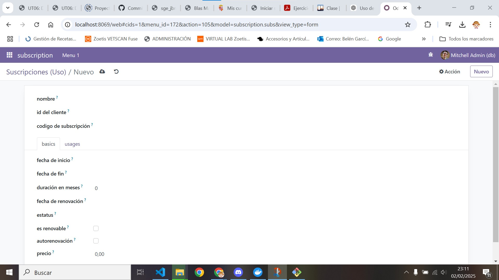
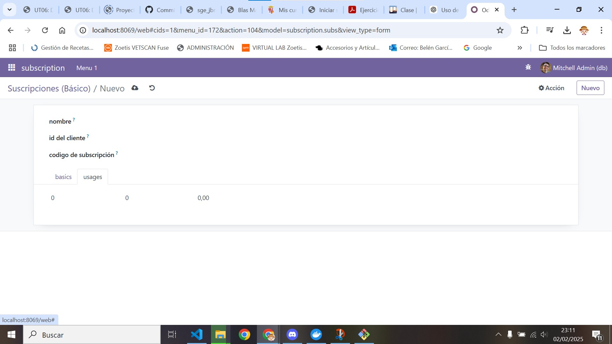

[Tema06](../index.md)

# PR0605: Vista de tipo formulario

---     
[PR0605](https://vgonzalez165.github.io/apuntes_sge/ut06_mvc_herencia/pr0605_vista_form.html)

## ¿Que vamos a hacer?
Modifica el módulo de gestión de suscripciones que creaste en la práctica anterior para que tenga una vista de formulario personalizada.

# 1. Creamos nuevos archivos en la carpeta de views
Crearemos 1 archivo xml de vista que muestre un nuevo form.

### Vista de form:
``` xml
<odoo>
  <data>
    <!-- explicit list view definition -->

    <record model="ir.ui.view" id="view_subscription_form_basic">
      <field name="name">subscription form</field>
      <field name="model">subscription.subs</field>
      <field name="arch" type="xml">
        <form string="Presas">
            <sheet>
                <group>
                    <field name="name" string='nombre'/>
                    <field name="customer_id" string='id del cliente'/>
                    <field name="subscription_code" string='codigo de subscripción'/>
                </group>
                <notebook>
                    <page name="basics" string="basics">
                        <group>
                            <field name="start_date" string='fecha de inicio'/>
                            <field name="end_date" string='fecha de fin'/>
                            <field name="duration_months" string='duración en meses'/>
                            <field name="renewal_date" string='fecha de renovación'/>
                            <field name="status" string='estatus'/>
                            <field name="is_renewable" string='es renovable'/>
                            <field name="auto_renewal" string='autorenovación'/>
                            <field name="price" string='precio'/>
                        </group>
                    </page>
                    <page name="usages" string="usages">
                        <field name="usage_limit" string='uso limite'/>
                        <field name="current_usage" string='uso actual'/>
                        <field name="use_percent" string='porcentaje de uso'/>
                    </page>
                </notebook>
            </sheet>
        </form>
      </field>
    </record>

    <!-- actions opening views on models -->

    <record id="action_subscription_form" model="ir.actions.act_window">
        <field name="name">Suscripciones (Form)</field>
        <field name="res_model">subscription.subs</field>
        <field name="view_mode">tree,form</field>
        <field name="view_id" ref="view_subscription_form_basic"/>
    </record>
  </data>
</odoo>
```

Separamos todo a sus páginas correspondientes y le asignamos una acción para que se pueda acceder a él, también lo separamos por grupos haciendo que así luego en la vista se separe.
también le pondremos la referencia para que se ponga en formato de form.

### Vista de menus:

``` xml
<odoo>
  <data>
    <!-- Top menu item -->

    <menuitem name="subscription" id="subscription.menu_root"/>

    <!-- menu categories -->

    <menuitem name="Menu 1" id="subscription.menu_1" parent="subscription.menu_root"/>

    <!-- actions -->

    <menuitem name="Basics" id="subscription.menu_1_list" parent="subscription.menu_1"
              action="action_subscription_basic"/>
    <menuitem name="Usage" id="subscription.menu_2_list" parent="subscription.menu_1"
              action="action_subscription_usage"/>
    <menuitem name="Form" id="subscription.menu_3_list" parent="subscription.menu_1"
              action="action_subscription_form"/>
  </data>
</odoo>
```

Le añadimos el action al menú para poder acceder a el.

Le hemos asignado una vista form a nuestro conjunto de vitas.

# 2. Modificamos el archivo manifest:
Añadimos la nueva vista que hemos creado, es decir el form.
``` python
# -*- coding: utf-8 -*-
{
    'name': "subscription",

    'summary': """
        Short (1 phrase/line) summary of the module's purpose, used as
        subtitle on modules listing or apps.openerp.com""",

    'description': """
        Long description of module's purpose
    """,

    'author': "My Company",
    'website': "https://www.yourcompany.com",
    'application': True,

    # Categories can be used to filter modules in modules listing
    # Check https://github.com/odoo/odoo/blob/16.0/odoo/addons/base/data/ir_module_category_data.xml
    # for the full list
    'category': 'Uncategorized',
    'version': '0.1',

    # any module necessary for this one to work correctly
    'depends': ['base'],

    # always loaded
    'data': [
        'security/ir.model.access.csv',
        'views/views_basic.xml',
        'views/views_usage.xml',
        'views/views_form.xml',
        'views/menus.xml',

    ],
    # only loaded in demonstration mode
    'demo': [
        'demo/demo.xml',
    ],
}
```

Tambien hemos añadido la nueva vista que hemos creado

# 3. Comprobamos que ha funcionado:
Comprobamos que hemos podido añadir los nuevos campos con las referencias necesarias que cumplen sus respectivas referencias en estas imágenes:
 
 
 